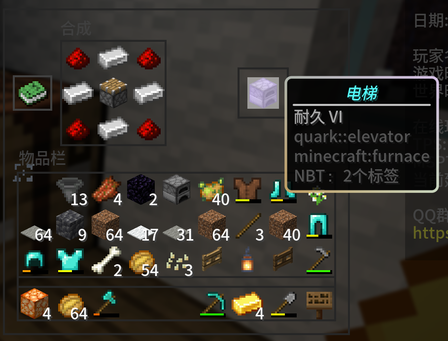

# 服务器功能
文：GrassBlock2022，TWSFTS_07007

-----

### 使用 TBSTQuark 插件点歌（midi 格式）
> 该板块的操作需要权限，请您注意；如需要权限，您可以赞助或通过抽奖获得。赞助链接见主页。

如果您想听歌，但是苦于电脑运行内存不足，同时对音质没什么要求 ，
您不妨试试 TBSTQuark 插件内的指令点歌功能。使用如下指令点歌：

```
/music play 歌曲名.midi
```


如果您不知道任何的歌曲名，您可以直接使用 Tab 键查看歌曲列表并选择。
选择完毕后按 Enter 或 Num Enter 键即可听到音乐。
由于 Minecraft 本身的限制，不能做到播放 *.mp3 等多媒体格式音乐，请见谅。

大部分时候音乐会在所有子服务器开始同步播放，但可能由于网络波动部分服务器无法自动同步。
这种情况下我们也没招，重新播放吧。

### 自由驾驶矿车

- 进入矿车的时候，矿车是不能自主移动的，且您的物品栏将被移动到中央位置。
- 将物品栏向右滑动进入加速档位，矿车将向您面朝的方向自动运行。
- 物品栏向右滑动，越过中央槽位即开始加速。档位越大加速度越大，直到设定最大速度(默认30m/s)。
- 物品栏向左滑动，越过中央槽位即开始减速。档位越大减速度越大，直到停车。

### 坐在楼梯上

- 空手右键楼梯才能坐下
- 如果一位玩家占用了一个楼梯那么你是坐不下的
- 如果一个楼梯被破坏了, 你会被甩下来
- 倒着的楼梯不能坐(这曾经是个bug现在修复了)
- 不用担心楼梯朝向，系统会自动校正你的玩家位置

### 导航点

- ```/waypoint add [name] [world] [x] [y] [z]``` 添加一个公共导航点(仅OP可用)
- ```/waypoint add [name] @self``` 以自己的位置添加一个公共导航点(仅OP可用)
- ```/waypoint remove [name]``` 移除一个公共导航点(仅OP可用)
- ```/waypoint tp [name]```  传送到一个公共导航点
- ```/waypoint add-private [name] [world] [x] [y] [z]``` 添加一个私有导航点
- ```/waypoint add-private [name] @self``` 以自己的位置添加一个私有导航点
- ```/waypoint remove-private [name]```  移除一个私有导航点
- ```/waypoint tp-private [name]``` 传送到一个私有导航点

### 一些杂七杂八的生存服小特性

- 对着农作物右键可以快速收集并且重新自动播种。不必担心，时运等附魔是起效的。
- 对着矿石或者木头潜行挖掘可以触发连锁采集。
- 试试把木头丢进切石机中，它们会有更高的产量。
- 不要使用发射器发射方块掉落物，它们会被直接放在发射器的脸上。
- 你可以做一个电梯方块来快速上下，配方是这样的：

